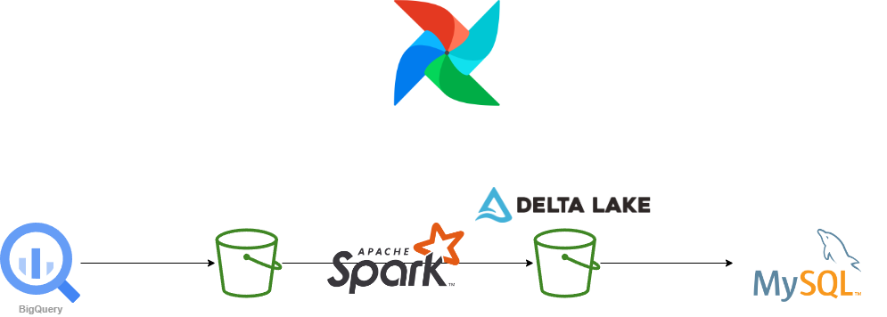

# The basic idea to sync them together

Assuming Google Cloud is the provider of all resources, the approach for this pipeline is to use Airflow Google Cloud Operators to execute the required commands.

So the first task is to use the BigQueryToGCSOperator to export the required tables to a Cloud Storage bucket.

The next task group is to execute a PySpark job to read the exported data and upsert or SCD into a delta table, then get only the most up-to-date data and create a CSV file that will be used on the last task to import it to the MySQL Cloud SQL Instance. This task group will have tasks to create a DataProc cluster (DataprocCreateClusterOperator), submit a PySpark job (DataprocSubmitJobOperator) and delete the DataProc cluster (DataprocDeleteClusterOperator).

And the last task is to use the CloudSQLImportInstanceOperator to import the CSV file into the MySQL Cloud SQL instance.

# A diagram on how the data flows, gets inserted, updated, deleted

## What happens if there is an isolated table ?
We can create DAGs for each table, but that would be a lot of DAGs to maintain. So we can create a DAG that will be triggered by a Cloud Function that will be triggered by a Pub/Sub topic that will be triggered by a BigQuery table change. This way we can have a single DAG that will be triggered by any table change and will execute the required tasks to sync the data.

## What happens when there are linked tables such as recipes, ingredients and relationships?
For linked tables we can create a single DAG that takes care of the dependencies between the tables. Extract data from the data warehouse in the order of dependency and load them into MySQL maintaining the same order.

# Optional

## How can it be monitored that processes work fine and the data is in sync?

1. Use the Airflow UI to monitor the DAGs and the tasks.
2. Slack notifications can be used to notify the team when a task fails and output a summary of the processed data.
3. Use a data validation tool like Great Expectations to define expectations for your data and integrate it with Airflow to validate your data at runtime.

## If for some reason data desyncs, how can Bob resync it?
Triggering a full backfill in Airflow to run the DAGs for a specific time range, replacing the existing data in MySQL.